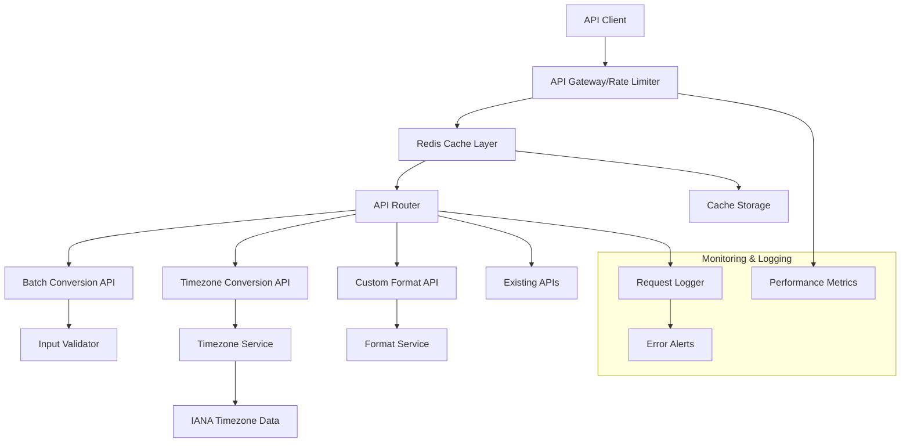

# Design Document

## Overview

This design document outlines the architecture for expanding the timestamp converter API with advanced functionality including batch conversion optimization, timezone conversion support, performance enhancements, and robust caching mechanisms. The design builds upon the existing Vercel serverless API structure while introducing new components for caching, rate limiting, and timezone handling.

## Architecture

### High-Level Architecture



### Component Architecture

The system will be organized into the following key components:

1. **API Gateway Layer**: Handles CORS, rate limiting, and request routing
2. **Cache Layer**: Redis-based caching for improved performance
3. **Core Services**: Business logic for conversions, timezone handling, and formatting
4. **Data Layer**: IANA timezone data and configuration storage
5. **Monitoring Layer**: Logging, metrics collection, and alerting

## Components and Interfaces

### 1. Enhanced API Gateway

```typescript
interface APIGatewayConfig {
  rateLimits: {
    anonymous: { requests: number; window: number };
    authenticated: { requests: number; window: number };
  };
  cache: {
    ttl: number;
    maxSize: number;
  };
}

interface RateLimitResult {
  allowed: boolean;
  remaining: number;
  resetTime: number;
}
```

**Responsibilities:**
- Request rate limiting based on IP and authentication status
- CORS handling for all endpoints
- Request/response logging and metrics collection
- Cache-Control header management

### 2. Cache Service

```typescript
interface CacheService {
  get<T>(key: string): Promise<T | null>;
  set<T>(key: string, value: T, ttl?: number): Promise<void>;
  del(key: string): Promise<void>;
  exists(key: string): Promise<boolean>;
  generateKey(request: CacheableRequest): string;
}

interface CacheableRequest {
  endpoint: string;
  parameters: Record<string, any>;
  userId?: string;
}
```

**Implementation:**
- Redis-based caching with configurable TTL
- LRU eviction policy for memory management
- Cache key generation based on request parameters
- Cache warming for frequently accessed data

### 3. Batch Conversion Service

```typescript
interface BatchConversionRequest {
  items: Array<string | number>;
  outputFormat?: string[];
  timezone?: string;
  options?: {
    continueOnError: boolean;
    maxItems: number;
  };
}

interface BatchConversionResponse {
  success: boolean;
  data: BatchConversionResult[];
  metadata: {
    totalItems: number;
    successCount: number;
    errorCount: number;
    processingTime: number;
  };
}

interface BatchConversionResult {
  input: string | number;
  success: boolean;
  data?: ConversionData;
  error?: APIError;
}
```

**Features:**
- Parallel processing of batch items
- Configurable batch size limits
- Error isolation (continue processing on individual failures)
- Result caching for identical batch requests

### 4. Timezone Conversion Service

```typescript
interface TimezoneService {
  convert(timestamp: number, fromTz: string, toTz: string): Promise<TimezoneConversionResult>;
  getTimezoneInfo(timezone: string): Promise<TimezoneInfo>;
  getCommonTimezones(): Promise<CommonTimezone[]>;
  validateTimezone(timezone: string): boolean;
}

interface TimezoneConversionResult {
  originalTimestamp: number;
  convertedTimestamp: number;
  fromTimezone: TimezoneInfo;
  toTimezone: TimezoneInfo;
  offsetDifference: number;
}

interface TimezoneInfo {
  identifier: string;
  displayName: string;
  currentOffset: number;
  isDST: boolean;
  dstTransitions?: DSTTransition[];
}

interface CommonTimezone {
  identifier: string;
  displayName: string;
  region: string;
  popularityRank: number;
}
```

**Features:**
- IANA timezone database integration
- DST transition handling
- Timezone validation and suggestions
- Common timezone shortcuts (EST, PST, etc.)

### 5. Custom Format Service

```typescript
interface FormatService {
  format(timestamp: number, formats: string[]): Promise<FormattedResult[]>;
  validateFormat(format: string): FormatValidationResult;
  getSupportedFormats(): SupportedFormat[];
}

interface FormattedResult {
  format: string;
  result: string;
  success: boolean;
  error?: string;
}

interface SupportedFormat {
  name: string;
  pattern: string;
  example: string;
  description: string;
}
```

**Supported Formats:**
- ISO 8601 variants
- RFC 2822
- Unix timestamp (seconds/milliseconds)
- Custom date/time patterns
- Locale-specific formats

### 6. Enhanced Error Handling

```typescript
interface APIError {
  code: string;
  message: string;
  details?: Record<string, any>;
  timestamp: number;
  requestId: string;
}

interface ErrorHandler {
  handleError(error: Error, context: RequestContext): APIError;
  logError(error: APIError, context: RequestContext): void;
  shouldAlert(error: APIError): boolean;
}
```

## Data Models

### 1. Request/Response Models

```typescript
interface EnhancedConversionRequest {
  // Single conversion
  timestamp?: number;
  date?: string;
  
  // Batch conversion
  items?: Array<string | number>;
  
  // Common parameters
  outputFormats?: string[];
  timezone?: string;
  targetTimezone?: string;
  
  // Options
  includeMetadata?: boolean;
  cacheControl?: 'no-cache' | 'force-refresh';
}

interface EnhancedConversionResponse {
  success: boolean;
  data: ConversionData | ConversionData[];
  metadata?: ResponseMetadata;
  cache?: CacheInfo;
  error?: APIError;
}

interface ConversionData {
  input: string | number;
  timestamp: number;
  formats: Record<string, string>;
  timezone?: TimezoneInfo;
  relative?: string;
}

interface ResponseMetadata {
  processingTime: number;
  itemCount: number;
  cacheHit: boolean;
  rateLimit: RateLimitInfo;
}
```

### 2. Configuration Models

```typescript
interface APIConfiguration {
  rateLimiting: {
    enabled: boolean;
    rules: RateLimitRule[];
  };
  caching: {
    enabled: boolean;
    defaultTTL: number;
    maxCacheSize: number;
  };
  timezone: {
    dataSource: string;
    updateInterval: number;
    fallbackTimezone: string;
  };
  monitoring: {
    logLevel: 'debug' | 'info' | 'warn' | 'error';
    metricsEnabled: boolean;
    alertThresholds: AlertThreshold[];
  };
}
```

## Error Handling

### Error Categories

1. **Client Errors (4xx)**
   - Invalid input format
   - Missing required parameters
   - Rate limit exceeded
   - Invalid timezone identifier

2. **Server Errors (5xx)**
   - Cache service unavailable
   - Timezone data service failure
   - Internal processing errors

3. **Service Errors**
   - External API failures
   - Database connection issues
   - Memory/resource constraints

### Error Response Format

```typescript
interface StandardErrorResponse {
  success: false;
  error: {
    code: string;
    message: string;
    details?: Record<string, any>;
    suggestions?: string[];
  };
  requestId: string;
  timestamp: number;
}
```

### Recovery Strategies

- **Cache Failures**: Fallback to direct computation
- **Timezone Service Failures**: Use cached timezone data
- **Rate Limiting**: Provide clear retry instructions
- **Partial Batch Failures**: Continue processing remaining items

## Testing Strategy

### 1. Unit Testing

**Components to Test:**
- Timezone conversion logic
- Format validation and conversion
- Cache key generation
- Rate limiting algorithms
- Error handling functions

**Test Coverage Goals:**
- 90%+ code coverage for core services
- 100% coverage for critical conversion logic
- Edge case testing for timezone transitions

### 2. Integration Testing

**Test Scenarios:**
- End-to-end API request flows
- Cache integration with Redis
- Rate limiting across multiple requests
- Batch processing with various input types
- Timezone conversion accuracy

### 3. Performance Testing

**Load Testing:**
- Concurrent batch conversion requests
- Rate limiting under high load
- Cache performance with large datasets
- Memory usage during peak traffic

**Benchmarks:**
- Single conversion: < 50ms response time
- Batch conversion (100 items): < 500ms response time
- Cache hit ratio: > 80% for repeated requests
- Rate limiting accuracy: 99.9%

### 4. API Contract Testing

**Contract Validation:**
- Request/response schema validation
- Error response format consistency
- HTTP status code correctness
- Header validation (CORS, cache-control)

### 5. Monitoring and Alerting Tests

**Monitoring Coverage:**
- Error rate thresholds
- Response time monitoring
- Cache hit rate tracking
- Rate limiting effectiveness

**Alert Testing:**
- Error spike detection
- Performance degradation alerts
- Cache service failure notifications
- Rate limiting threshold breaches

## Implementation Considerations

### 1. Deployment Strategy

- **Serverless Architecture**: Continue using Vercel serverless functions
- **Cache Deployment**: Redis instance (Vercel KV or external Redis)
- **Configuration Management**: Environment-based configuration
- **Monitoring Setup**: Integration with existing monitoring tools

### 2. Performance Optimizations

- **Connection Pooling**: Reuse Redis connections across requests
- **Batch Processing**: Parallel processing for batch conversions
- **Memory Management**: Efficient data structures for large batches
- **CDN Integration**: Cache static timezone data at edge locations

### 3. Security Considerations

- **Input Validation**: Strict validation for all input parameters
- **Rate Limiting**: IP-based and user-based rate limiting
- **CORS Configuration**: Restrictive CORS policies for production
- **Error Information**: Limit sensitive information in error responses

### 4. Scalability Planning

- **Horizontal Scaling**: Stateless serverless functions
- **Cache Scaling**: Redis cluster for high availability
- **Database Scaling**: Timezone data replication
- **Monitoring Scaling**: Distributed logging and metrics collection