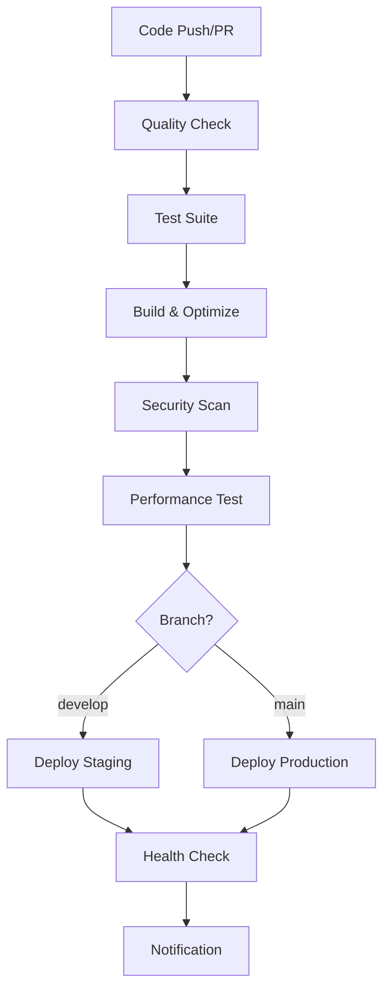

# 🚀 CI/CD Pipeline Documentation

This document provides comprehensive documentation for the TSConv CI/CD pipeline implementation.

## Overview

The CI/CD pipeline is designed to ensure code quality, security, and reliable deployments through automated workflows. The pipeline includes multiple stages for testing, building, security scanning, and deployment across different environments.

## Pipeline Architecture

### Workflow Structure

## Workflows

### 1. Main CI/CD Pipeline (`.github/workflows/ci.yml`)

**Triggers:**
- Push to `main` or `develop` branches
- Pull requests to `main`
- Manual workflow dispatch

**Jobs:**

#### 🔍 Quality Check
- **Duration**: ~5 minutes
- **Purpose**: Code quality and security validation
- **Steps**:
  - ESLint code analysis
  - TypeScript type checking
  - Security audit
  - Bundle size analysis
  - Image optimization check
  - Cache strategy validation

#### 🧪 Test Suite
- **Duration**: ~10 minutes
- **Strategy**: Matrix testing (unit, integration, e2e)
- **Purpose**: Comprehensive testing coverage
- **Features**:
  - Parallel test execution
  - Code coverage reporting
  - Codecov integration

#### 🏗️ Build & Optimize
- **Duration**: ~8 minutes
- **Purpose**: Production-ready build generation
- **Features**:
  - Image optimization
  - Bundle analysis
  - Build artifact generation
  - Performance metrics

#### 🔒 Security Scan
- **Duration**: ~5 minutes
- **Purpose**: Vulnerability detection
- **Tools**:
  - Trivy filesystem scanner
  - SARIF report generation
  - Security headers validation

#### ⚡ Performance Test
- **Duration**: ~10 minutes
- **Purpose**: Performance validation
- **Features**:
  - Lighthouse CI integration
  - Performance budget enforcement
  - Core Web Vitals monitoring

#### 🚀 Deployment
- **Staging**: Automatic on `develop` branch
- **Production**: Automatic on `main` branch
- **Features**:
  - Multi-platform deployment (Vercel, Cloudflare)
  - Health checks
  - Rollback capabilities

### 2. Code Quality Workflow (`.github/workflows/code-quality.yml`)

**Triggers:**
- Pull requests
- Push to main branches
- Weekly scheduled runs

**Jobs:**

#### 📊 Static Analysis
- ESLint with JSON reporting
- TypeScript strict mode validation
- Code complexity analysis
- Artifact generation for reports

#### 📊 Code Coverage
- Comprehensive test coverage
- Codecov integration
- PR coverage comments
- Coverage trend analysis

#### 📦 Dependency Analysis
- Vulnerability scanning
- License compliance checking
- Bundle size monitoring
- Dependency update recommendations

#### ⚡ Performance Analysis
- Bundle size analysis
- Image optimization verification
- Cache strategy validation
- Performance regression detection

#### 🚪 Quality Gate
- Aggregated quality metrics
- Pass/fail determination
- PR status updates
- Quality trend reporting

### 3. Release Workflow (`.github/workflows/release.yml`)

**Triggers:**
- Git tags (v*.*.*)
- Manual workflow dispatch

**Jobs:**

#### 🔍 Validate Release
- Version format validation
- Pre-release detection
- Release notes preparation

#### 🏗️ Build Release
- Production build generation
- Test execution
- Build artifact creation
- Release archive generation

#### 🔒 Security Scan
- Release-specific security validation
- Vulnerability blocking for critical issues
- Security report generation

#### 📋 Create Release
- GitHub release creation
- Changelog generation
- Asset upload
- Release notes publication

#### 🌟 Deploy Release
- Production deployment
- Health verification
- Success notification

## Deployment Strategies

### Staging Environment
- **Trigger**: Push to `develop` branch
- **Platform**: Vercel preview deployment
- **Purpose**: Feature validation and testing
- **URL**: `https://tsconv-staging.vercel.app`

### Production Environment
- **Trigger**: Push to `main` branch or release tag
- **Platforms**: 
  - Primary: Vercel production
  - Secondary: Cloudflare Pages
- **Purpose**: Live application serving
- **URL**: `https://tsconv.com`

### Deployment Features
- **Zero-downtime deployments**
- **Automatic rollback on health check failure**
- **Multi-platform redundancy**
- **Performance monitoring**
- **Real-time health checks**

## Docker Support

### Container Configuration
- **Base Image**: `nginx:alpine`
- **Multi-stage build**: Optimized production image
- **Security**: Non-root user execution
- **Health Checks**: Comprehensive application monitoring

### Docker Compose
- **Development**: Local development environment
- **Production**: Complete application stack
- **Monitoring**: Optional Prometheus/Grafana integration
- **Logging**: Centralized log management

## Security Features

### Code Security
- **Static Analysis**: ESLint security rules
- **Dependency Scanning**: npm audit integration
- **Vulnerability Detection**: Trivy scanner
- **SARIF Integration**: GitHub security tab

### Container Security
- **Non-root execution**: Security-first container design
- **Minimal attack surface**: Alpine-based images
- **Security headers**: Comprehensive HTTP security
- **Health monitoring**: Continuous security validation

### Deployment Security
- **HTTPS enforcement**: SSL/TLS termination
- **Security headers**: CSP, HSTS, XSS protection
- **Access control**: Environment-based restrictions
- **Audit logging**: Comprehensive access logs

## Performance Monitoring

### Build Performance
- **Bundle size tracking**: Automated size monitoring
- **Build time optimization**: Cached dependencies
- **Artifact efficiency**: Optimized asset generation

### Runtime Performance
- **Lighthouse CI**: Automated performance testing
- **Core Web Vitals**: User experience metrics
- **Performance budgets**: Regression prevention
- **Real user monitoring**: Production performance tracking

### Infrastructure Performance
- **Container metrics**: Resource usage monitoring
- **Health checks**: Application availability
- **Response time tracking**: API performance
- **Error rate monitoring**: Reliability metrics

## Quality Gates

### Code Quality Requirements
- **ESLint**: No errors, warnings allowed
- **TypeScript**: Strict mode compliance
- **Test Coverage**: Minimum 80% coverage
- **Security**: No critical vulnerabilities

### Performance Requirements
- **Lighthouse Performance**: Score ≥ 90
- **Lighthouse Accessibility**: Score ≥ 95
- **Lighthouse Best Practices**: Score ≥ 90
- **Lighthouse SEO**: Score ≥ 90

### Build Requirements
- **Bundle Size**: Maximum 500KB initial
- **Image Optimization**: All images optimized
- **Cache Strategy**: Proper cache headers
- **Security Headers**: All security headers present

## Automation Features

### Dependency Management
- **Dependabot**: Automated dependency updates
- **Security Updates**: Priority security patches
- **Grouped Updates**: Logical dependency grouping
- **Review Process**: Automated PR creation

### Code Quality
- **Automated Linting**: Pre-commit hooks
- **Format Enforcement**: Prettier integration
- **Type Checking**: Continuous TypeScript validation
- **Test Automation**: Comprehensive test execution

### Deployment Automation
- **Branch-based Deployment**: Automatic environment targeting
- **Health Verification**: Post-deployment validation
- **Rollback Automation**: Failure recovery
- **Notification Integration**: Team communication

## Monitoring and Alerting

### Build Monitoring
- **Workflow Status**: Real-time build monitoring
- **Failure Notifications**: Immediate team alerts
- **Performance Trends**: Build time tracking
- **Resource Usage**: Infrastructure monitoring

### Application Monitoring
- **Uptime Monitoring**: 24/7 availability tracking
- **Performance Monitoring**: User experience metrics
- **Error Tracking**: Application error monitoring
- **Security Monitoring**: Threat detection

### Infrastructure Monitoring
- **Container Health**: Docker container monitoring
- **Resource Usage**: CPU, memory, disk monitoring
- **Network Performance**: Connectivity monitoring
- **Log Aggregation**: Centralized logging

## Best Practices

### Development Workflow
1. **Feature Branches**: Isolated feature development
2. **Pull Requests**: Code review process
3. **Quality Checks**: Automated validation
4. **Testing**: Comprehensive test coverage

### Deployment Process
1. **Staging Validation**: Feature testing in staging
2. **Production Deployment**: Automated production release
3. **Health Verification**: Post-deployment validation
4. **Monitoring**: Continuous application monitoring

### Security Practices
1. **Dependency Updates**: Regular security updates
2. **Vulnerability Scanning**: Continuous security validation
3. **Access Control**: Environment-based restrictions
4. **Audit Logging**: Comprehensive security logging

## Troubleshooting

### Common Issues
- **Build Failures**: Dependency or compilation issues
- **Test Failures**: Code quality or functionality issues
- **Deployment Failures**: Infrastructure or configuration issues
- **Performance Issues**: Bundle size or optimization problems

### Resolution Steps
1. **Check Workflow Logs**: Detailed error information
2. **Review Quality Reports**: Code quality metrics
3. **Validate Configuration**: Environment settings
4. **Test Locally**: Reproduce issues locally

### Support Resources
- **Documentation**: Comprehensive guides
- **Monitoring Dashboards**: Real-time metrics
- **Log Analysis**: Detailed troubleshooting
- **Team Communication**: Collaborative problem-solving

## Future Enhancements

### Planned Features
- **Advanced Monitoring**: Enhanced observability
- **A/B Testing**: Feature flag integration
- **Progressive Deployment**: Canary releases
- **Multi-region Deployment**: Global distribution

### Optimization Opportunities
- **Build Performance**: Further optimization
- **Test Parallelization**: Faster feedback
- **Cache Optimization**: Improved efficiency
- **Resource Optimization**: Cost reduction

The CI/CD pipeline provides a robust, secure, and efficient development and deployment process that ensures high-quality releases while maintaining developer productivity and system reliability.
