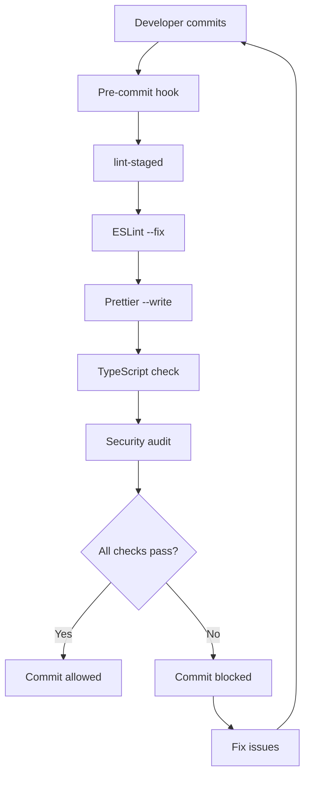
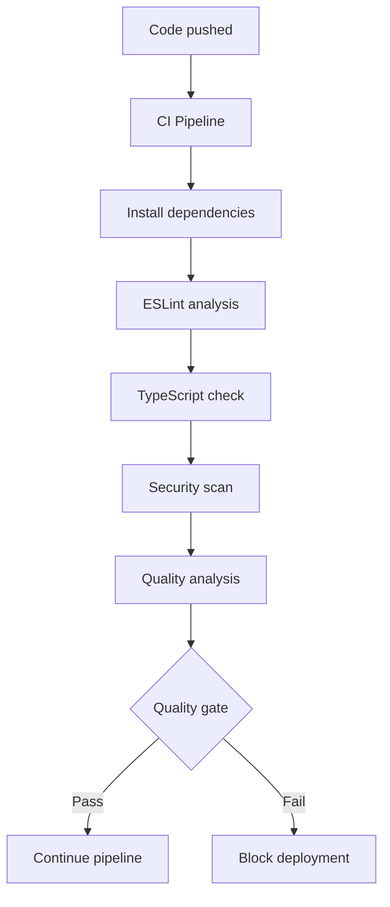

# 🔍 Code Quality Automation Documentation

This document provides comprehensive documentation for the automated code
quality system implemented in the TSConv project.

## Overview

The code quality automation system ensures consistent, high-quality code through
automated tools and processes that run at various stages of development:

- **Pre-commit hooks**: Automatic formatting and linting before commits
- **Continuous integration**: Quality checks in CI/CD pipeline
- **IDE integration**: Real-time feedback during development
- **Automated reporting**: Comprehensive quality analysis and metrics

## Tools and Technologies

### Core Quality Tools

#### ESLint

- **Purpose**: Static code analysis and linting
- **Configuration**: `.eslintrc.json`
- **Features**:
  - TypeScript support with `@typescript-eslint`
  - React and React Hooks rules
  - Accessibility checks with `jsx-a11y`
  - Security rules with `eslint-plugin-security`
  - Code quality rules with `sonarjs`
  - Import organization with `eslint-plugin-import`

#### Prettier

- **Purpose**: Code formatting and style consistency
- **Configuration**: `.prettierrc.json`
- **Features**:
  - Consistent formatting across all file types
  - Integration with ESLint
  - Automatic formatting on save
  - Support for JavaScript, TypeScript, JSON, CSS, Markdown

#### TypeScript

- **Purpose**: Type checking and compile-time error detection
- **Configuration**: `tsconfig.json`
- **Features**:
  - Strict type checking
  - Import/export validation
  - Interface and type safety
  - Modern JavaScript features

### Git Hooks (Husky)

#### Pre-commit Hook

```bash
# Runs automatically before each commit
- lint-staged: Format and lint only staged files
- TypeScript type checking
- Security audit
- Test execution (if tests exist)
```

#### Commit Message Hook

```bash
# Validates commit message format
- Conventional commit format validation
- Helpful error messages with examples
- Integration with commitizen for guided commits
```

### Automated Scripts

#### Code Quality Analysis (`scripts/code-quality-analysis.cjs`)

- **ESLint Analysis**: Detailed linting report with issue categorization
- **TypeScript Analysis**: Type error detection and reporting
- **Security Audit**: Vulnerability scanning with npm audit
- **Complexity Analysis**: Code complexity metrics and file analysis
- **Quality Scoring**: Overall quality score with grade assignment

#### Code Formatting (`scripts/format-code.cjs`)

- **Prettier Formatting**: Automatic code formatting
- **ESLint Auto-fix**: Automatic fixing of linting issues
- **Import Organization**: Sorting and organizing import statements
- **File Cleanup**: Trailing whitespace and line ending normalization

## Configuration Files

### ESLint Configuration (`.eslintrc.json`)

```json
{
  "extends": [
    "eslint:recommended",
    "@typescript-eslint/recommended",
    "plugin:react/recommended",
    "plugin:react-hooks/recommended",
    "plugin:jsx-a11y/recommended",
    "plugin:import/recommended",
    "plugin:security/recommended",
    "plugin:sonarjs/recommended",
    "prettier"
  ]
}
```

**Key Rules**:

- **React**: JSX best practices, hooks rules
- **TypeScript**: Type safety, unused variables
- **Security**: Object injection, unsafe regex detection
- **Accessibility**: ARIA attributes, semantic HTML
- **Code Quality**: Complexity limits, duplicate detection

### Prettier Configuration (`.prettierrc.json`)

```json
{
  "semi": true,
  "trailingComma": "es5",
  "singleQuote": true,
  "printWidth": 100,
  "tabWidth": 2,
  "useTabs": false
}
```

### Lint-staged Configuration (`.lintstagedrc.json`)

```json
{
  "*.{js,jsx,ts,tsx}": ["eslint --fix", "prettier --write"],
  "*.{json,md,yml,yaml,css,scss}": ["prettier --write"]
}
```

### Commitlint Configuration (`.commitlintrc.json`)

```json
{
  "extends": ["@commitlint/config-conventional"],
  "rules": {
    "type-enum": [
      2,
      "always",
      [
        "feat",
        "fix",
        "docs",
        "style",
        "refactor",
        "perf",
        "test",
        "build",
        "ci",
        "chore",
        "revert",
        "security",
        "deps",
        "config"
      ]
    ]
  }
}
```

## IDE Integration

### VS Code Settings (`.vscode/settings.json`)

```json
{
  "editor.formatOnSave": true,
  "editor.codeActionsOnSave": {
    "source.fixAll.eslint": true,
    "source.organizeImports": true
  },
  "editor.defaultFormatter": "esbenp.prettier-vscode"
}
```

**Features**:

- Automatic formatting on save
- ESLint auto-fix on save
- Import organization
- Real-time error highlighting
- Consistent editor settings

### Recommended Extensions

```json
{
  "recommendations": [
    "esbenp.prettier-vscode",
    "dbaeumer.vscode-eslint",
    "ms-vscode.vscode-typescript-next",
    "bradlc.vscode-tailwindcss",
    "ms-vscode.vscode-json"
  ]
}
```

## NPM Scripts

### Quality Check Scripts

```bash
# Format code
npm run format              # Check formatting
npm run format:fix          # Fix formatting issues
npm run format:check        # Check with Prettier
npm run format:write        # Write with Prettier

# Linting
npm run lint                # Run ESLint
npm run lint:fix            # Fix ESLint issues

# Type checking
npm run type-check          # TypeScript type checking

# Comprehensive quality checks
npm run quality:analysis    # Full quality analysis
npm run quality:full        # Complete quality check
npm run quality:fix         # Fix all auto-fixable issues

# Commit helpers
npm run commit              # Interactive commit with commitizen
```

### CI/CD Integration Scripts

```bash
# CI quality pipeline
npm run ci:quality          # Quality checks for CI
npm run ci:build            # Build with quality checks
npm run ci:test             # Test execution
```

## Quality Metrics and Scoring

### Quality Score Calculation

The automated quality analysis generates a score out of 100 based on:

- **ESLint Issues**: -2 points per error, -0.5 per warning (max -30)
- **TypeScript Errors**: -3 points per error (max -40)
- **Security Vulnerabilities**: -10 per critical, -5 per high
- **Code Complexity**: -2 points per complex file over threshold

### Grade Assignment

- **A (90-100)**: Excellent code quality
- **B (80-89)**: Good code quality
- **C (70-79)**: Acceptable code quality
- **D (60-69)**: Poor code quality, needs improvement
- **F (0-59)**: Failing code quality, requires immediate attention

### Reporting

Quality reports are generated in `reports/` directory:

- `eslint-report.json`: Detailed ESLint analysis
- `code-quality-report.json`: Comprehensive quality metrics

## Workflow Integration

### Development Workflow

1. **Write Code**: IDE provides real-time feedback
2. **Save Files**: Automatic formatting and linting
3. **Stage Changes**: Git hooks ensure quality
4. **Commit**: Message validation and final checks
5. **Push**: CI/CD pipeline runs comprehensive checks

### Pre-commit Process



### CI/CD Quality Gates



## Best Practices

### Code Style Guidelines

1. **Consistent Formatting**: Use Prettier for all formatting
2. **Linting Rules**: Follow ESLint recommendations
3. **Type Safety**: Leverage TypeScript's type system
4. **Import Organization**: Keep imports organized and sorted
5. **Commit Messages**: Use conventional commit format

### Quality Maintenance

1. **Regular Updates**: Keep linting rules and tools updated
2. **Quality Reviews**: Regular code quality analysis
3. **Threshold Monitoring**: Monitor quality score trends
4. **Team Training**: Ensure team understands quality standards

### Performance Optimization

1. **Incremental Checks**: Only check changed files when possible
2. **Parallel Execution**: Run checks in parallel where feasible
3. **Caching**: Leverage tool caching for faster execution
4. **Selective Rules**: Enable only necessary rules for performance

## Troubleshooting

### Common Issues

#### ESLint Errors

```bash
# Fix auto-fixable issues
npm run lint:fix

# Check specific files
npx eslint src/components/MyComponent.tsx --fix
```

#### Prettier Conflicts

```bash
# Check formatting
npm run format:check

# Fix formatting
npm run format:write
```

#### TypeScript Errors

```bash
# Check types
npm run type-check

# Check specific file
npx tsc --noEmit src/components/MyComponent.tsx
```

#### Pre-commit Hook Issues

```bash
# Skip hooks (emergency only)
git commit --no-verify

# Fix hook permissions
chmod +x .husky/pre-commit
```

### Performance Issues

#### Slow Linting

- Use `.eslintignore` to exclude unnecessary files
- Disable expensive rules for large files
- Use ESLint cache: `--cache` flag

#### Large File Handling

- Exclude generated files from quality checks
- Use file size limits in quality tools
- Consider splitting large files

## Continuous Improvement

### Metrics Tracking

Track quality metrics over time:

- ESLint error/warning trends
- TypeScript error trends
- Quality score progression
- Code complexity evolution

### Tool Updates

Regular maintenance schedule:

- Monthly: Update ESLint rules and plugins
- Quarterly: Review and update Prettier configuration
- Bi-annually: Major tool version updates

### Team Feedback

Collect and incorporate team feedback:

- Rule effectiveness surveys
- Performance impact assessments
- Developer experience improvements
- Quality standard adjustments

## Conclusion

The automated code quality system provides:

✅ **Consistent Code Style**: Prettier ensures uniform formatting ✅ **Error
Prevention**: ESLint catches issues before they reach production ✅ **Type
Safety**: TypeScript prevents runtime type errors ✅ **Security Scanning**:
Automated vulnerability detection ✅ **Quality Metrics**: Objective quality
measurement and tracking ✅ **Developer Experience**: Real-time feedback and
automatic fixes ✅ **CI/CD Integration**: Quality gates in deployment pipeline

This comprehensive system ensures high code quality while maintaining developer
productivity and providing clear feedback for continuous improvement.
